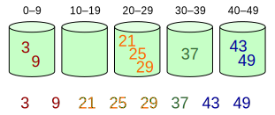

= 桶排序

桶排序也是一种非比较的排序，它通过函数计算元素与新数组的映射关系，将元素尽可能均匀映射到新数组中，如果多个值计算后映射到同一个位置，它们会存储在子序列中，完后这些值会通过某种排序算法进行排序。最后遍历新数组有序地获取映射的元素，就可以得到有序的数组。

新数组的每一个元素称为桶 (bucket)，一个桶通常由一个数组或链表构成，用来有序地保存值。

对于待排序的数组，需要创建的桶的数量并没有统一的规则，可以根据数据的分布情况而定。桶排序算法是否高效关键在于映射函数，而每一个桶中元素的排序算法对性能的影响也是至关重要的。

假设要对数组 `[29, 25, 3, 49, 9, 37, 21, 43]` 执行桶排序。肉眼可以观察最大值最小值在50以内，并且数组的元素总数不超过10个。所以桶的划分策略可以是这样的：以10为区间划分每个桶，即第一个桶区间是0\~9，第二个是10~19，依此类推。下图展示元素是如何分配到桶中的。

元素分配到桶之后，接下来需要对桶中的多个元素排序。如果所示。

代码示例：

https://github.com/oobot/learning-algorithms/blob/bd3d4efa17cd048a2e200582b933f625dd029e59/src/sort/bucket_sort/mod.rs#L3-L36

当要被排序的数组内的数值是均匀分配的时候，桶排序的时间复杂度是线性的__O__(_n_)。反之，受桶内元素排序算法影响很大。桶排序需要设置一个定量的数组当作空桶子，所以在数据分布均匀的情况下，空间复杂度至少是__O__(_n_)。但通常情况没有这么理想，甚至需要比要排序的数据大得多的空间。

桶排序算法不具有通用性。通常，不同的数据情况需要不同的映射函数。想要高效地运用桶排序，需要事先清楚数据的分布情况，才好确定映射策略，这也导致了桶排序算法应用场景很有限。若不慎使用了不佳的映射策略，元素分布很不均匀，部分桶存储的元素过多，也会影响桶排序算法效率。