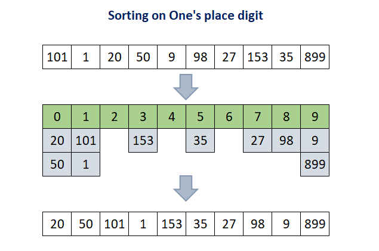
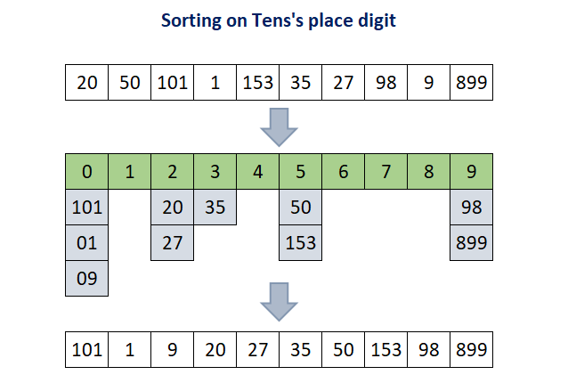
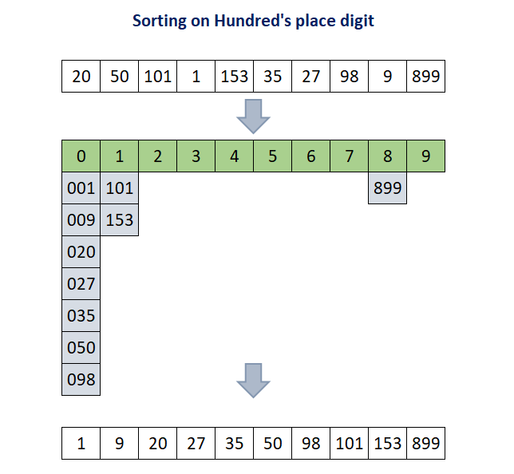

= 基数排序

基数排序（Radix sort）是一种非比较型排序算法，其发明可以追溯到1887年赫尔曼·何乐礼在列表机（Tabulation Machine）上的贡献。它的原理是将整数按位数切割成不同的数字，然后分别比较每个位的数。由于字符串和特定格式的浮点数也可以用整数表示，所以基数排序也可以用于整数之外的类型。

基数这个词的意思是数字系统的基，10是十进制系统基数，2是二进制系统的基数。以2为基数的基数排序能够利用计算机位运算，所以它可以非常高效，但为了便于讲解说明，这里讨论的基数排序都是以10为基数的运算。

这里讨论的排序是以10为基数的运算，我们需要创建长度为10的数组。每个待排序的元素从个位开始计算值，将结果按索引映射到新数组中，相同的结果用数组或链表保存，然后按顺序取出。依次计算十位、百位，不够的用0补齐。基数排序也可以用于负数，简单起见，这里只讨论非负数的情况。

来看待排序数组 `[101, 1, 20, 50, 9, 98, 27, 153, 35, 899]` 过程示意：

代码示例：
https://github.com/oobot/learning-algorithms/blob/023597536fc74f68b942da20c58a3472d6f75c21/src/sort/radix_sort/mod.rs#L1-L40

基数排序的时间复杂度是__O__(_k•n_)，其中__n__是排序元素个数，__k__是数字位数，即最大数字的长度，数字的长度决定了需要进行多少轮处理，__n__是每轮处理操作的数目。基数排序需要额外的空间保存中间结果，它需要多个链表或数组保存中间结果，总长度与待排序数组相等。此外，索引这些数组或链表还需要常数级的数组，不过这可以忽略不计。
