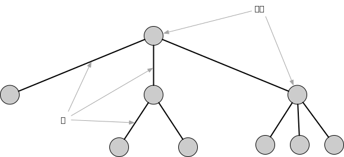
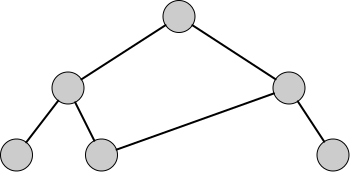
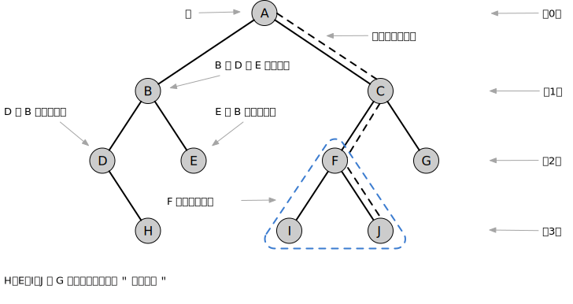

= 树

先来思考下有序数组和链表的问题，然后再深入地研究树的细节。

== 有序数组的缺点
用二分查找可以在有序数组中快速查找特定的值，其时间复杂度是__O__(log__n__) 。但是，要向有序的数组插入一个新的数据项就没有那么快了。首先必须查找新数据项应插入的位置，为了给新数据项腾出位置，需要把比新数据项大的数据整体往后挪动一位。如果多次移动，会很费时。平均来讲需要移动数组中一半的数据。删除数据项也很慢，需要将比删除项大的数据往前挪动一位，多次这样的操作也是很费时的。

== 链表的缺点
不同于数组，链表的插入和删除操作很快，只需要改变其中的一些引用值就可以了，它的时间复杂度是__O__(1)。但是在链表中查找数据项就没那么容易了，链表不像数组那样可以通过索引直接访问某个数据项，它只能从头开始查找，依次访问链表中的每个数据项，直到找到为止。这个过程平均需要访问一半数据项，而且要跟访问的数据项逐个做比较，这个过程会很慢，时间复杂度是__O__(_n_)，对于排序是比较快的，但是对于操作数据结构来说是挺慢的。

== 用树解决这些问题

树这种数据结构解决了上面的问题，不仅像链表那样快速插入和删除数据项，又能像有序数组那样快速查找数据项。它同时拥有有序数组和链表的优点。

== 什么是树？

下图展示了一棵普通的树。

树的顶层始终只有一个节点，连接节点的直线称为边，它表示关联节点间的路径。从根节点到其它任何节点的路径有且只有一条。树顶层节点通过边连接到第二层的多个节点，然后第二层的节点连接到第三层的多个节点，依此类推。就像真的树颠倒过来，顶部小，底部大。下图并不是树，因为从根节点到某个节点多于一条路径。

=== 术语

普通树的子节点有多个，多于两个，称为多路树。下图展示的是二叉树，它是一种特殊的树。二叉树的每个节点最多有两个子节点。

路径:: 顺着节点从一个节点到领一个节点，所经过的节点边称为"路径"。

根:: 树顶端节点称为"根"，一棵树只有一个根。

父节点:: 除了根节点之外，每个节点都恰好有一条边向上连接到另一个节点，上面的这个节点就称为下面节点的"父节点"。

子节点:: 每个节点都可能有一条或多条边乡下连接到其他节点，下面的节点就称为它的"子节点"。

叶节点:: 没有子节点的节点称为"叶子节点"，简称为"叶节点"。

子树:: 每个节点都可以作为"子树"的根，它和它的所有子节点、子节点的子节点都包含在子树中。

层:: 从根开始到一个节点有多少"代"，就表示这个节点在第几层。假设根节点是第0层，那它的子节点就是第1层，孙节点就是第2层，依此类推。

访问:: 当程序控制流程到达某个节点时，就称为"访问"这个节点，通常是为了在这个节点执行某种操作，例如查看节点的数据。如果仅仅是一个节点到达另一个节点过程中经过某个节点，那么不会认为访问了这个节点。

遍历:: 遍历树意味着遵循某种特定的顺序访问树中的所有节点。比如可以按节点值的升序访问所有节点等。
