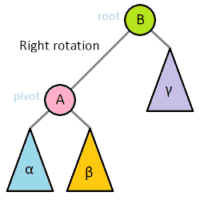
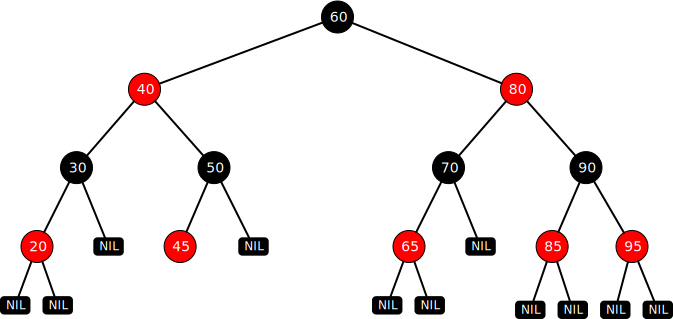

= 平衡二叉查找树

二叉查找树是有缺点的，在一些比较极端的情况下，它很容易退化成链表，执行效率也会退化成__O__(_n_)。比如在插入有序的数据时，如下图所示。

== AVL 树

AVL 树在1962年被发明，是最早的一种平衡二叉树，它以发明者 Adelson-Velsky 和 Landis 的名字命名。它的目标是在二叉查找树中插入和删除值时，树的结构变化会被检测并得到修补调整，保证任意左右两棵子树的高度差不超过1，也就是左右子树高度差不会大于1层。

NOTE: 平衡二叉树指的是左右两个子树的高度差不超过1。

AVL 树是一种高度平衡的二叉树，它的结构跟二叉查找树是一样的。

=== 树的旋转

树的旋转分为左旋转（逆时针旋转）和右旋转（顺时针旋转），如下图所示。

左旋转提升右子节点替换父节点，右旋转提升左子结点为父节点，然后再重新连接子节点。动画清晰地展示了这个过程。

在添加节点后，左右子树的高度差为2，需要通过一次旋转来重新平衡，如下图所示。

插入节点后，检查新节点所在最低子树的根，如果它的子节点高度相差大于1，执行1次或两次选择使他们高度相等。然后算法向上移动，检查上面的节点，必要时均衡高度。沿着所有路径一直向上检查，直到根为止。

image::images/avl_tree_insert.gif[title="AVL 树插入节点左右旋转及组合旋转"]

删除节点与二叉查找树并无二异。删除后也需要重新扫描，看是否需要旋转来重新平衡这棵树。

AVL 树是一种高度平衡的二叉查找树，它的查找效率是 __O__(log__n__)。但是每一次插入和删除节点时需要扫描两趟树，除了一次向下查找插入点之外，还需要向上平衡树。对于插入和删除操作频繁的场景，性能未必很好。

== 红黑树

__红黑树（Red–black tree）__是另一种自平衡二叉查找树，它在1972年由Rudolf Bayer发明，当时被称为__对称二叉B树（symmetric binary B-trees）__。在1978年被 Leo J. Guibas 和 Robert Sedgewick 修改为如今的“红黑树”。红黑树结构复杂，但它有良好的最差运行时间，在实践中也被证明了其高效，可以在 __O__(log__n__) 实践内完成插入、查找和删除。

红黑树在实践中有着广泛的应用。Java 的 TreeMap、TreeSet 和 C++ STL 中的 set、map，便是使用红黑树作为底层数据结构，自 JDK1.8，HashMap 引入了红黑树解决哈希冲突，当冲突的链表长度超过8时，自动转为红黑树。Nginx 的 Timer 管理以及 Linux 虚拟内存管理等等，都能看到它的应用。

红黑树不像 AVL 树高度平衡，它通过一些特性，确保树仍有较高的平衡性。相较于 AVL 树，红黑树舍弃了一定的平衡性，换取插入和删除的高效，并且扔保持 __O__(log__n__) 查找性能。

红黑树本质上是一棵二叉查找树。除了二叉查找树的特性之外，红黑树还多了这些特性：

1. 每个节点要么是黑色要么是红色。
2. 根节点始终是黑色。
3. 每个叶子结点（null）都是黑色的。
4. 两个红色节点不能直接相连。
5. 从一个节点到其每个叶子节点的所有路径，都包含相同数目的黑色节点。

红色节点的子节点必须是黑色的，黑色节点的子节点可以是红色的，也可以是黑色的。这些特性是用来保证红黑树自平衡的，黑色属性可以理解为**平衡特性**。特性4和特性5确保红黑树是接近平衡的二叉树，任意节点到叶子节点最长路径不超出最短路径的两倍。另外，与二叉查找树不同的是，红黑树中不存在相同值的节点。

TIP: 节点颜色只是一个比喻，并不是非得红色和黑色，用任意两种颜色来表示都可以。

下图是一棵典型的红黑树。

当插入节点和删除节点时，可能会破坏平衡，需要对树重新调整以恢复平衡。调整方式有两种：旋转和变色。旋转跟 AVL 树类似，以某个支点左旋转或右旋转；变色通常是将节点颜色红变黑或黑变红。当插入红色节点或者旋转后与特性4相悖情况时，需要向上检查改变节点的颜色。

=== 添加节点

红黑树本身是一棵二叉查找树，向红黑树添加节点与二叉查找树并无二异，插入新节点后仍然是一棵二叉查找树。不同的是后续处理，如果添加根节点，根节点将被设置成黑色。添加为其他节点则设置成红色，然后通过旋转相应子树和对相应节点重新着色修正，让它仍然是一棵红黑树。

通常将插入的节点设定为红色（根节点除外），因为红色破坏特性的可能性最小，如果设为黑色，那么可能这条支路的黑色节点会比其它支路多1，违背了特性5。设定成红色能使我们少违背一条特性，后续需要处理的情况就会少一些。满足了特性5之后，还需要满足特性4："两个红色节点不能直接相连"，还需要后续的一系列的旋转或着色等操作。

TIP: 如果存在相等的值，则用新值更新相应节点，红黑树不存在两个值相等的节点。

插入新节点会出现以下5种场景

==== 场景1：插入节点是根节点
直接把节点作为根节点就可以了，根据红黑树特性2，还需要把根节点设置成黑色。

==== 场景2：插入节点的父节点是黑色
由于父节点是黑色，插入红色节点并不影响红黑树的平衡，不需调整。
// 图

==== 场景3：插入节点的父节点是红色且叔叔节点也是红色

首先将父节点和叔叔节点都设为黑色。

1. 根据特性4，两个红色节点不能直接相连，因此需要将父节点设置为黑色。
2. 根据特性5，所以将另一个支路的叔叔节点也设置成黑色。

祖父节点也需要设置成红色。假如 `x` 节点是黑色，则此次插入节点结束了。若是红色，则将 `x` 节点当成新插入的红色节点，持续往上处理，或变色或旋转，直到插入节点是黑色节点为止。

==== 场景4：插入节点的父节点是红色，叔叔节点是黑色或空

===== 场景4.1：作为左子结点插入，且父节点是左子结点

image::images/rbtree_add_case5.1.svg[title="以节点8为支点右旋转"]

NOTE: 上图中叔叔节点16黑色看似处于不平衡状态，但这只是红黑树的局部图。

. 以祖父节点 `8` 为支点向右旋转
. 父节点和祖父节点变色

不需要继续向上处理，因为祖父节点的颜色最终没变。

===== 场景4.2：作为右子节点插入，且父节点是左子结点

以插入节点的父节点左旋转，接着转到场景4.1继续处理。

===== 场景4.3：作为右子节点插入，且父节点是右子节点

与场景4.1互为镜像。

. 以祖父节点 `8` 为支点向左旋转
. 父节点和祖父节点变色

===== 场景4.4：作为左子节点插入，且父节点是右子节点

image::images/rbtree_add_case5.4.svg[title="以节点16为支点右旋转"]

与场景4.2互为镜像。以插入节点的父节点为支点右旋转，接着转到场景4.3继续处理。

TIP: 往上变色而不往下是为了避免某个支路多出黑色节点。

=== 删除节点

