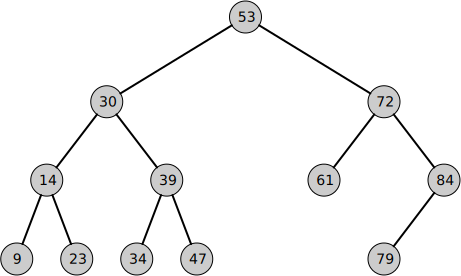
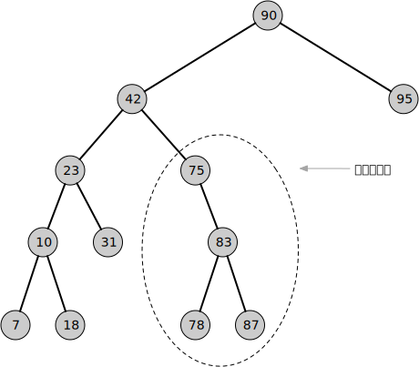
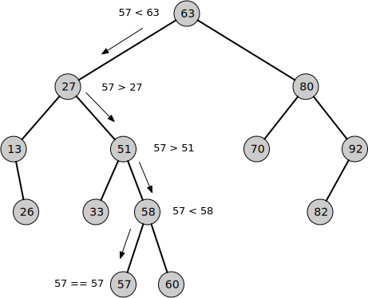
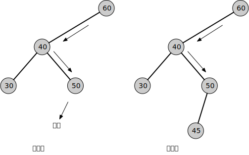
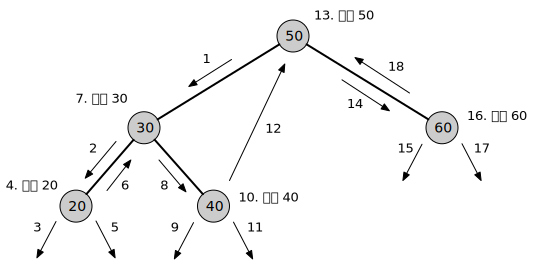
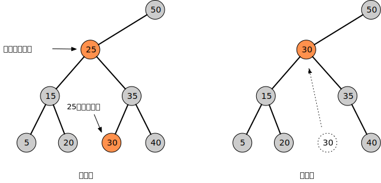

= 二叉树

如果树中的每个节点最多只有两个子节点，这样的树称为"二叉树"，它是最简单，也是最常用的树。二叉树每个节点左边的子节点称为"左子结点"，右边子节点称为"右子节点"。当然，二叉树的节点不是必须有两个子节点，它可以只有一个子节点，右子节点或左子节点，也可以没有子节点，这种情况它是叶节点。

如果一个节点的左子结点值小于这个节点的值，右子节点值大于或等于这个节点值，这样的二叉树称为"二叉查找树"。下图展示了一棵二叉查找树。

非平衡树:: 如果一棵树的大部分节点在根节点的左边或右边，那么这颗树就是非平衡树。下图展示了一棵非平衡树。

树之所以变得不平衡，是由于数据项插入顺序导致的。如果插入值的大小是随机的，树整体会变得比较平衡。反之，如果以升序插入值，所有值都会是右子节点，如果以降序插入值，那么所有值都会是左子节点。实际上，多少都会有些短的升序或降序的数列出现，这会使树的局部不平衡。如果一棵树过于失衡，它的效率会严重退化。往后的AVL树和红黑树会涉及这个话题。

== 用代码表示树

用 `Node` 表示一个节点，节点有 `T` 类型的值，可能有左子节点和右子节点。`Tree` 表示一棵树，查找、插入和删除方法定义在 `Tree` 上。

https://github.com/oobot/learning-algorithms/blob/66f52e2953cf6fa8bb1b44a839da84bf0593427b/src/tree/binary_tree/mod.rs#L2-L10

== 查找

假设要查找值为57的节点，为了方便讨论，以下图举例说明。首先57和根节点63比较，57较小，所以要找的结果可能在当前节点的左侧。继续往下查找左子结点，左子节点的值是27，小于57，所以结果可能在当前节点右侧。继续往下查找右子节点，58比57大，所以结果可能在左子结点。继续找左子结点，这个节点的值是57，与我们要找的值相等，所以这个就是我们要找的节点。

代码示例：

https://github.com/oobot/learning-algorithms/blob/66f52e2953cf6fa8bb1b44a839da84bf0593427b/src/tree/binary_tree/mod.rs#L20-L30

从上面的查找过程可以看出，二叉查找树查找节点的时间复杂度是__O__(log__n__)，查找节点所需的次数取决于这个节点所在的层数。节点所在层数越浅，所需步骤越少；层数越深，所需步骤就越多。

== 插入

二叉查找树成立的条件是：对于每一个子树，左子结点 < 父节点 < 右子节点。要插入节点，首先得找到插入的地方。从根节点开始查找，将**新节点作为叶子结点**插入满足这个条件的地方，如下图所示。

代码示例：

https://github.com/oobot/learning-algorithms/blob/66f52e2953cf6fa8bb1b44a839da84bf0593427b/src/tree/binary_tree/mod.rs#L32-L49

== 遍历

遍历树指的是以一种特定的顺序访问树的每一个节点。与通常按线性顺序遍历的线性数据结构不同，树结构有多种不同的遍历方式。从二叉树的根节点出发，遍历（操作）当前节点、遍历左子节点、遍历右子节点。这三个步骤的先后顺序决定了不同遍历方式的根本区别。这种不关心节点值的遍历方式，它可以用于任何二叉树，而不仅仅是二叉查找树。

由于树本身是一种递归定义的数据结构，因此很自然可以用递归方式，也是最简单的方式。

=== 中序遍历

遍历二叉查找树最常用的方法是中序遍历（In-Order Traversal），所有节点按值的升序被访问，它可以从二叉查找树中创建有序数据序列。中序遍历依序以左子结点、根节点、右节点为顺序的遍历方式，以左中右顺序遍历。过程如下图所示。

代码示例：

https://github.com/oobot/learning-algorithms/blob/66f52e2953cf6fa8bb1b44a839da84bf0593427b/src/tree/binary_tree/mod.rs#L51-L57

=== 前序遍历和后序遍历

除了中序遍历，还有前序遍历（Pre-Order Traversal）和后序遍历（Post-Order Traversal）。

前序遍历:: 依次以根节点、左节点、右节点为顺序的遍历方式。

https://github.com/oobot/learning-algorithms/blob/66f52e2953cf6fa8bb1b44a839da84bf0593427b/src/tree/binary_tree/mod.rs#L59-L65

对于以树结构保存的文件及目录，前序遍历可以用来实现目录结构的显示。如果是目录，先输出目录名，然后再依次输出目录下的所有文件(包括子目录)。如果有子目录，再进入子目录，输出子目录下的所有文件名。这是一个典型的前序遍历过程。

后序遍历:: 依次以左节点、右节点、根节点为顺序的遍历方式。

https://github.com/oobot/learning-algorithms/blob/66f52e2953cf6fa8bb1b44a839da84bf0593427b/src/tree/binary_tree/mod.rs#L67-L73

后序遍历可以用来统计某个目录的大小，即目录下所有文件的总大小。若要知道某目录的大小，必须先知道目录下所有文件的大小。若存在子目录，要知道子目录的大小，就必须先知道子目录下所有文件的大小。这是一个典型的后序遍历过程。

== 查找最大值和最小值

查找二叉搜索树的最大值和最小值很容易。只要理解好二叉搜索树的本质：从根节点一直往左走，直到节点不再有左子节点，那么此节点便是最小值的节点。查找最大值同理，从根节点一直往右走，找到右叶子节点，此叶子节点便是最大值的节点。

查找最小值::
https://github.com/oobot/learning-algorithms/blob/2e4fb347983314d5ff6a6bcbdd285904736e4abb/src/tree/binary_tree/mod.rs#L75-L81

查找最大值::
https://github.com/oobot/learning-algorithms/blob/2e4fb347983314d5ff6a6bcbdd285904736e4abb/src/tree/binary_tree/mod.rs#L83-L89

== 删除

从二叉查找树中删除节点比较复杂，删除节点需先查找到要删的节点。找到节点后，有三种情况需要考虑：

是叶子节点:: 这种情况最简单，由于没有子节点，直接删除就好了。
只有一个子节点:: 这种情况也简单，将子节点往上提，用子节点替代要删除的节点。
有两个子节点:: 这种情况最复杂。需要仔细分情况讨论。

若有两个子节点，删除父节点后，显然不能用任一个子节点替代父节点，因此需要另一种方法。二叉查找树是按照节点值的升序排列的，即左子结点 < 父节点 < 右子节点。要删除的节点我们称它为初始节点，作为替换的节点称为后继结点。程序找到要初始节点后，它的右子节点一定大于或等于初始节点，只要沿着右子节点的左边路径一直走到末端，就能找到我们需要的后继节点，而且它是大于初始节点左子结点的最小的后继结点。如下图所示。

如果初始节点的右子节点没有左子结点，那么这个右子节点本身就是后继结点。

代码示例：

还有一种简单的解决办法可以避开删除节点这个棘手的问题。对于要删除的节点，我们可以给它添加一个标记，表示它已经无效了。在删除情况不多的情况下，这么做还是挺有用的。但是如果删除操作有很多，这么做的话会让整棵树的查找效率变得低下。

== 效率

TODO

== 用数组表示树

TODO