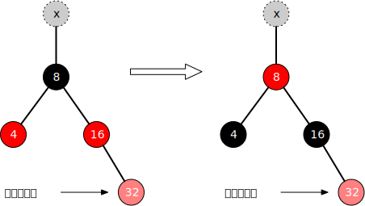
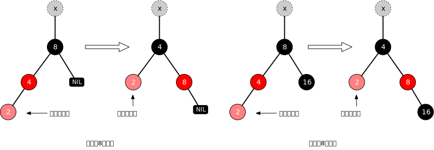
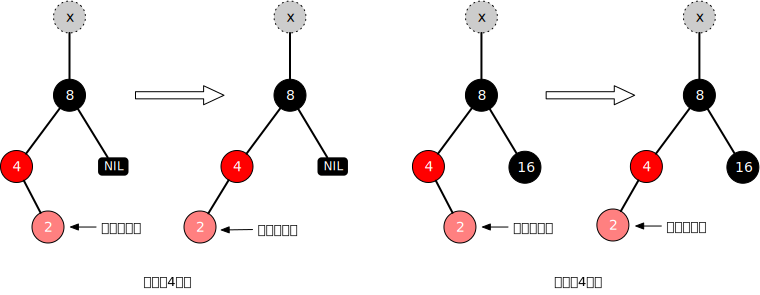
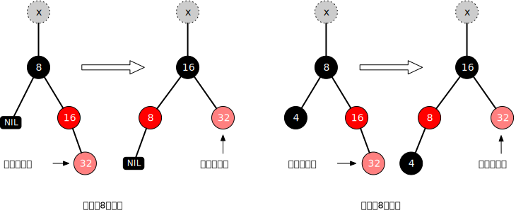
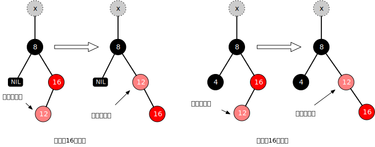

= 红黑树

如果一棵二叉树的左子结点数量和右子节点数量大致相等，我们称它为平衡二叉树。随机向二叉查找树添加数据，会得到一棵比较平衡的树，平衡的二叉查找树执行效率很好。但是，如果插入的是有序的数据，效率就会变得很低了。因为如果数据是升序的数据，所有节点都会作为右子节点插入到树中，如果是降序，会以左节点形式插入树中。不管升序还是降序，都会让二叉查找树实质上退化成一个链表。查找效率也从__O__(log__n__)退化成__O__(_n_)。即使有序的只有一部分，也会让树变得不平衡，查找效率也不如__O__(log__n__)。

由此可见，让二叉查找树维持平衡，才保持高效率。红黑树 (Red-Black Tree) 便是平衡二叉查找树中的一种。红黑树的应用比较广泛，例如，Java 集合中的 TreeSet 和 TreeMap，C++ STL 中的 set、map，以及 Linux 虚拟内存的管理，都是通过红黑树来实现的。红黑树主要用作存储有序数据，它的时间复杂度是__O__(log__n__)，效率非常高。

红黑树本质上是一棵二叉查找树。除了二叉查找树的规则之外，红黑树还多了这些规则：

1. 每个节点要么是黑色要么是红色。
2. 根节点始终是黑色。
3. 每个叶子结点（null）都是黑色的。
4. 两个红色节点不能直接相连。
5. 从一个节点到其每个叶子节点的所有路径，都包含相同数目的黑色节点。

黑色属性可以理解为**平衡特性**，节点颜色只是一个比喻，并不是非得红色和黑色，用任意两种颜色来表示都可以。红色节点的子节点必须是黑色的，黑色节点的子节点可以是红色的，也可以是黑色的。这些规则是用来保证红黑树自平衡的。规则4和规则5确保红黑树是接近平衡的二叉树，任意节点到叶子节点最长路径不超出最短路径的两倍。另外，与二叉查找树不同的是，红黑树中不存在相同值的节点。

下图是一棵典型的红黑树。

image::images/red_black_tree.svg[alt="", title="一棵红黑树"]

== 恢复平衡
当插入节点和删除节点时，可能会破坏平衡，需要对树重新调整以恢复平衡。调整方式有两种：变色和旋转。

=== 变色
变色通常是将节点颜色红变黑或黑变红。当插入红色节点或者旋转后与规则4相悖情况时，需要向上检查改变节点的颜色。

=== 旋转
旋转有左旋转和右旋转，即逆时针旋转和顺时针旋转。如下图。

image::images/binary_tree_rotations.svg[title="树的旋转"]

左旋转就是提升右子节点替换父节点，右旋转是提升左子结点为父节点，然后再重新连接子节点。动画清晰地展示了这个过程。

image::images/tree_rotation_animation.gif[title="树的旋转动画"]

二叉查找树旋转后仍然是二叉查找树。

== 添加节点

红黑树本身是一棵二叉查找树，向红黑树添加节点与二叉查找树并无二异，插入新节点后仍然是一棵二叉查找树。不同的是后续处理，如果添加根节点，根节点将被设置成黑色。添加为其他节点则设置成红色，然后通过旋转相应子树和对相应节点重新着色修正，让它仍然是一棵红黑树。

通常将插入的节点设定为红色（根节点除外），因为红色破坏规则的可能性最小，如果设为黑色，那么可能这条支路的黑色节点会比其它支路多1，违背了规则5。设定成红色能使我们少违背一条规则，后续需要处理的情况就会少一些。满足了规则5之后，还需要满足规则4："两个红色节点不能直接相连"，还需要后续的一系列的旋转或着色等操作。

插入新节点会出现以下5种情形

=== 情形1：插入节点是根节点
直接把节点作为根节点就可以了，根据红黑树规则2，还需要把根节点设置成黑色。

=== 情形2：插入节点的父节点是黑色
由于父节点是黑色，插入红色节点并不影响红黑树的平衡，不需调整。
// 图

=== 情形3：插入节点的父节点是红色且叔叔节点也是红色

首先将父节点和叔叔节点都设为黑色。

1. 根据规则4，两个红色节点不能直接相连，因此需要将父节点设置为黑色。
2. 根据规则5，所以将另一个支路的叔叔节点也设置成黑色。

祖父节点也需要设置成红色。假如 `x` 节点是黑色，则此次插入节点结束了。若是红色，则将 `x` 节点当成新插入的红色节点，持续往上处理，或变色或旋转，直到插入节点是黑色节点为止。

=== 情形4：插入节点的父节点是红色，叔叔节点是黑色或空

==== 情形4.1：作为左子结点插入，且父节点是左子结点

NOTE: 上图中叔叔节点16黑色看似处于不平衡状态，但这只是红黑树的局部图。

. 以祖父节点 `8` 为支点向右旋转
. 父节点和祖父节点变色

不需要继续向上处理，因为祖父节点的颜色最终没变。

==== 情形4.2：作为右子节点插入，且父节点是左子结点

以插入节点的父节点左旋转，接着转到情形4.1继续处理。

==== 情形4.3：作为右子节点插入，且父节点是右子节点

与情形4.1对称。

. 以祖父节点 `8` 为支点向左旋转
. 父节点和祖父节点变色

==== 情形4.4：作为左子节点插入，且父节点是右子节点

与情形4.2对称。以插入节点的父节点右旋转，接着转到情形4.3继续处理。

TIP: 往上变色而不往下是为了避免某个支路多出黑色节点。

后面三种情形的核心处理思路都是：往上将节点转成红色，直至根节点（根节点为黑色）。如果存在比较相等的值，则用新值更新相应节点，红黑树不存在两个值相等的节点。
