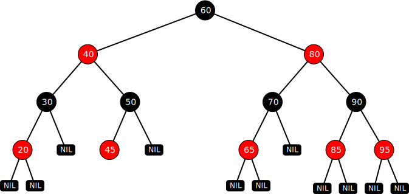

= 红黑树

如果一棵二叉树的左子结点数量和右子节点数量大致相等，我们称它为平衡二叉树。随机向二叉查找树添加数据，会得到一棵比较平衡的树，平衡的二叉查找树执行效率很好。但是，如果插入的是有序的数据，效率就会变得很低了。因为如果数据是升序的数据，所有节点都会作为右子节点插入到树中，如果是降序，会以左节点形式插入树中。不管升序还是降序，都会让树实质上变成一个链表。查找效率也从平衡查找二叉树的__O__(log__n__)变成了__O__(_n_)。即使有序的只有一部分，也会让树变得不平衡，查找效率也不如__O__(log__n__)。另外，删除节点也可能让树变得不平衡。

由此可见，让二叉查找树尽可能维持平衡，才能成为高效的二叉查找树。红黑树 (Red-Black Tree) 便是平衡二叉查找树中一种。红黑树的应用比较广泛，例如，Java 集合中的 TreeSet 和 TreeMap，C++ STL 中的 set、map，以及 Linux 虚拟内存的管理，都是通过红黑树来实现的。红黑树主要用作存储有序数据，它的时间复杂度是__O__(log__n__)，效率非常高。

红黑树除了二叉查找树的规则之外，还多了这些规则：

每一个节点不是红色就是黑色的::
节点颜色只是一个比方，并不是非得红色和黑色，可以是任意两种颜色来表示。

根节点始终是黑色的::

所有叶子结点都是黑色的::
这里所说的叶子结点指的是 `NIL` 或 `NULL` 节点。

如果一个节点是红色的，那么它的子节点必须是黑色的::
从每个叶子到根的所有路径上，不能存在两个连续的红色节点，也就是说两个红色节点不能是父子关系；红色节点的父节点和子节点均是黑色。

从一个节点到其每个叶子节点的所有路径都包含相同数目的黑色节点::
这确保了一条路径不会比其它路径长出两倍，确保红黑树是接近平衡的二叉树。

